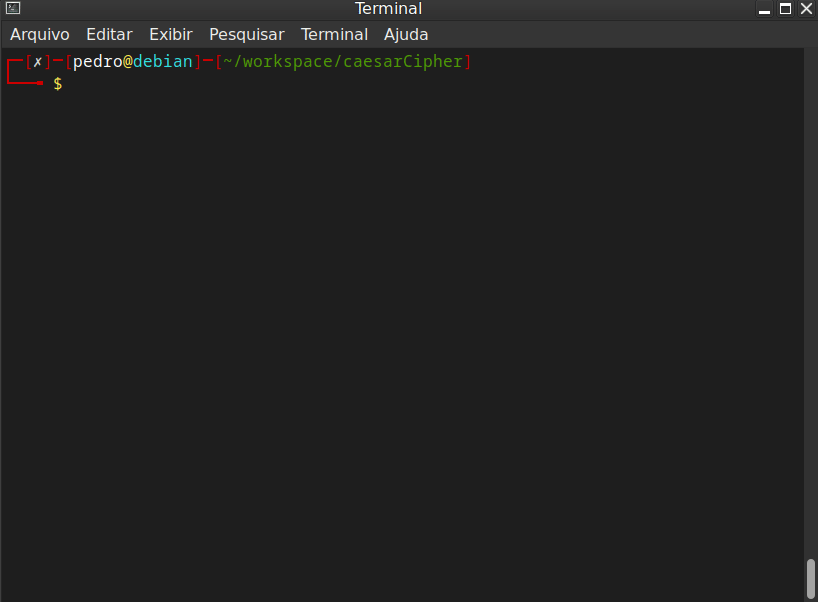

# caesarCipher

Caesar Cipher in BashScript

Estou desenvolvendo um jogo para o ensino de comando no terminal Linux,
Então precisava de algum tipo de criptografia para poder esconder alguns
valores que só eu poderia ter acesso fácil. Optei por fazer o algorítimo
da Cifra de César por ser mais fácil.

O massa é que pude praticar um pouco em Bash Script, visto que é uma linguagem que estou raramente trabalhando. Também sua sintáxe é bem incommun comparadas as linguagens que comumente uso, como JavaScript.

